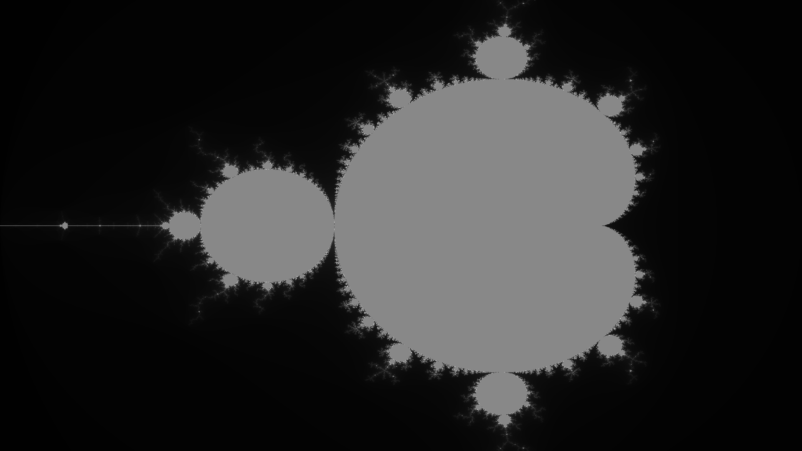
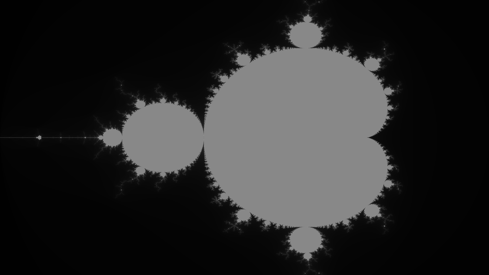
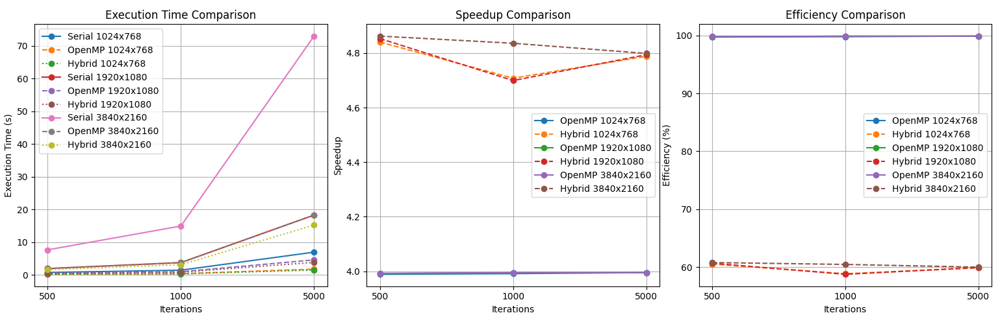

# Mandelbrot Fractal Generator (Serial, OpenMP, Hybrid MPI+OpenMP)

Three implementations of the Mandelbrot set renderer in C, benchmarked on
Northeastern's Explorer cluster across **3 resolutions** (1024x768, FHD,
4K) and **3 iteration depths** (500, 1000, 5000) for a 27-configuration
sweep. Outputs are written as PPM and converted to PNG.

## Demo

| 1024x768                                         | 1920x1080                                          | 3840x2160 (4K)                                     |
|--------------------------------------------------|----------------------------------------------------|----------------------------------------------------|
|  |  |  |

All three rendered with the hybrid MPI+OpenMP implementation at 5000
iterations.

## Headline result



On 4 MPI ranks x 2 OpenMP threads (8 logical workers):

| Resolution  | Iter | Serial (s) | OpenMP 4t (s) | Hybrid 4x2 (s) | Hybrid speedup |
|-------------|------|-----------:|--------------:|---------------:|---------------:|
| 1024x768    | 5000 | 6.924      | 1.734         | 1.447          | 4.79x          |
| 1920x1080   | 5000 | 18.249     | 4.569         | 3.808          | 4.79x          |
| 3840x2160   | 5000 | 72.987     | 18.272        | 15.207         | 4.80x          |

OpenMP at 4 threads gets ~4.0x speedup; hybrid 4-rank x 2-thread adds
distributed parallelism on top for a consistent **~4.8x** over serial,
~97% of the theoretical 4 ranks x 1.0 efficiency for the dominant work
phase. See `results/results_log.txt` for the full 27-row sweep.

## Implementations

| Mode    | Parallelism                          | Schedule                  |
|---------|--------------------------------------|---------------------------|
| serial  | 1 thread                             | -                         |
| openmp  | OpenMP, default 4 threads            | `dynamic` for-loop schedule, balances load across rows of varying iteration count |
| hybrid  | MPI ranks x OpenMP threads per rank  | row-block decomposition across ranks, dynamic OpenMP within each rank |

The hybrid kernel partitions image rows across MPI ranks (`HEIGHT / size`
rows per rank, with the last rank absorbing any remainder), then each
rank parallelizes its row block with OpenMP. Rank 0 gathers the full
image with `MPI_Gather` and writes the PPM.

Color is `iter mod 256` written as a grayscale RGB triple — the visual
banding shows escape-time bands at each modular wraparound.

## Build

Compile with `mpicc` and OpenMP enabled:

```bash
module load OpenMPI            # if on Explorer / a cluster with modules
mpicc -fopenmp -O3 -o mandelbrot src/mandelbrot.c
```

The `-O3` is recommended; without it the inner Mandelbrot loop is the
bottleneck and dominates wall time.

## Run

### One-off
```bash
# Serial
./mandelbrot serial 1920 1080 1000

# OpenMP (4 threads)
export OMP_NUM_THREADS=4
./mandelbrot openmp 1920 1080 1000

# Hybrid (4 MPI ranks x 2 OpenMP threads each)
export OMP_NUM_THREADS=2
mpirun -np 4 ./mandelbrot hybrid 1920 1080 1000
```

Each call writes a PPM named `mandelbrot_<mode>_<W>x<H>_<iter>iter.ppm`
and appends a line to `results_log.txt`.

### Full 27-config sweep on SLURM

```bash
cd src
sbatch mandelbrot.sbatch
```

The SBATCH script:
- requests 4 tasks x 2 cpus-per-task, 4 GB RAM, 1 hour walltime
- compiles with `mpicc -fopenmp`
- iterates over `{1024x768, 1920x1080, 3840x2160}` x `{500, 1000, 5000}`
  x `{serial, openmp, hybrid}`
- writes 27 PPMs and a row per run into `results_log.txt`

## Convert and visualize results

```bash
# Convert PPMs to PNGs (use any PPM directory)
python scripts/conversion.py mandelbrot_outputs/

# Generate execution-time / speedup / efficiency plots from the
# numbers hardcoded in plot.py (mirrors results_log.txt)
python scripts/plot.py
```

`scripts/plot.py` produces a 3-panel figure: execution time vs iterations,
speedup vs iterations, and efficiency vs iterations, each across all three
resolutions for both OpenMP and hybrid runs.

## Repository layout

```
Mandelbrot-Fractals-Using-Serial-OpenMP-and-Hybrid-MPI-OpenMP/
  src/
    mandelbrot.c                    # serial + OpenMP + hybrid implementations
    mandelbrot.sbatch               # SLURM batch script for the 27-config sweep
  scripts/
    conversion.py                   # PPM -> PNG batch converter (Pillow)
    plot.py                         # 3-panel performance plot generator
  results/
    results_log.txt                 # full 27-run benchmark log
    performance_comparison.png      # rendered execution time + speedup + efficiency
  outputs/                          # 3 sample fractals (one per resolution)
```

## Notes

- The total work is **load-imbalanced by construction**: pixels inside
  the Mandelbrot set hit `MAX_ITER` while pixels far outside escape in a
  few iterations. The OpenMP loop uses `schedule(dynamic)` so light rows
  return to the pool quickly; the hybrid partition splits by row chunks
  but each chunk is still dynamic-OpenMP internally.
- Communication overhead in the hybrid mode is exactly one `MPI_Gather`
  at the end. For these problem sizes that's negligible compared to the
  compute, which is why the hybrid speedup is close to the OpenMP speedup
  multiplied by the number of ranks.
- PPMs are uncompressed and large (~6 MB at 1024x768, ~25 MB at 4K).
  They're gitignored; only three PNG samples in `outputs/` are committed
  for visual reference.
